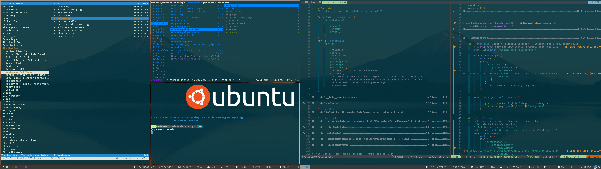

# Michael's dotfiles

Configuration files for everything I use frequently.

Ubuntu 24.04 LTS w/ Regolith 3 desktop

## Installation notes

* Required
  - kitty
    + May need to install kitty-terminfo package depending on install method
  - neovim
  - ranger
  - Python
    + python3-full
    + python3-pip
    + `python3 -m pip install --break-system-packages neovim-remote pipenv jedi pynvim black pylint`
  - node/npm
    + `sudo npm install -g eslint prettier globals @eslint/js eslint-plugin-vue`
  - zsh
    + zsh
    + oh-my-zsh
      * First set alternate dir (`ZSH="$HOME/.config/zsh/.oh-my-zsh"`), install, then copy relevant dotfiles
    + This changes default shell to zsh.
  - neofetch
  - libfuse2
  - universal-ctags
  - fortune + fortunes
  - trash-cli
  - clang
    + clang-format

* Optional
  - htop
  - silversearcher-ag
  - exfalso
  - cmus
  - keepass2
  - qbittorrent

* Install Firefox plugins
  - Tree style tab
  - Vimmatic
  - Enhancer for YouTube
  - Sponsorblock

* Install Nerd Fonts
  - FiraCode

* Make symlinks in .local/bin for AppImages
  - `ln -s ../AppImages/nvim-linux-x86_64.appimage nvim`
  - `ln -s ../kitty.app/bin/kitty kitty`

* Remove regolith-wm-base-launchers package
  - WARNING: Make sure ~/.config/regolith2/i3/15_base_launchers has been copied first

* Install regolith packages
  - i3xrocks-time
  - i3xrocks-temp
  - May be others?

* May need to remove regolith-i3-control-center-gnome (conflicting i3 config with regolith-i3-control-center-regolith)

# TODO
* vimrc cleanup
* Review /etc/fstab and /etc/sudoers
* Remove unused features/options from kitty-nvim

Let me know if I've included your work without attribution, the wrong license etc.
